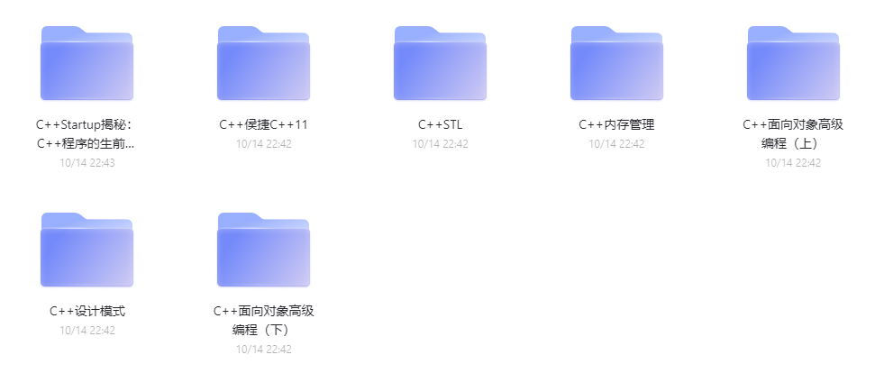
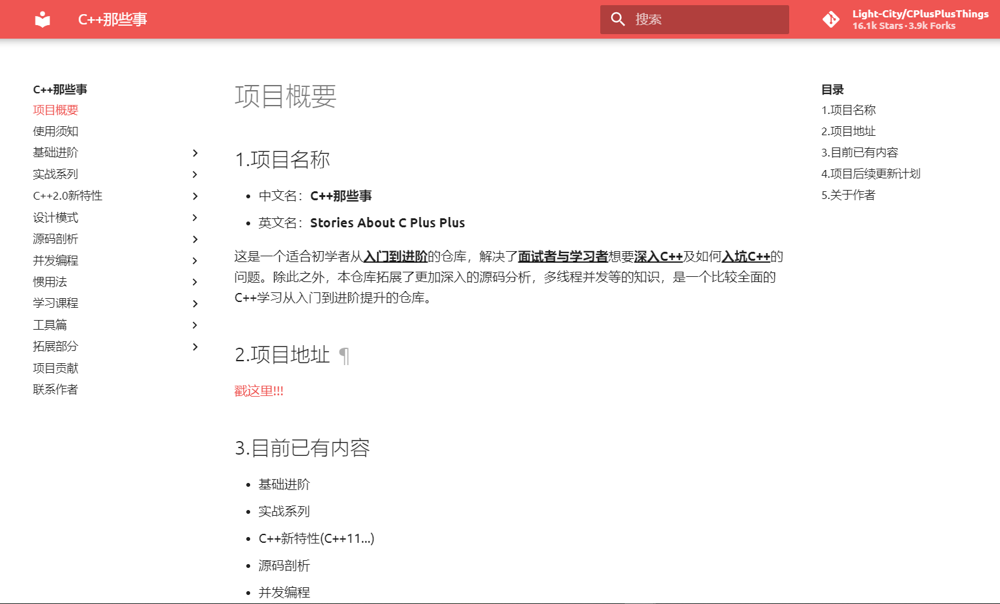
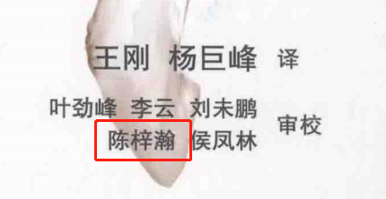

# deep_reinforcement_learning_learning_route
深度强化学习学习路线

# 一、公共基础知识

### 1. 编程基础（重要程度：⭐⭐⭐⭐⭐)

我们一般情况下要至少掌握两门语言，一门静态语言（C++ or Java），一门动态语言（Python），就可以应付大多数的问题。对于不是计算机、机器人或相关专业，只是想应用机器学习和深度学习的情况，可以只掌握Python，了解C++即可。

**1）C++**

C++可以分为C++基础编程和C++高级编程。如果有C语言基础，建议直接略过基础编程部分，这部分和C语言编程没有太大的区别，那么直接从C++高级编程开始。

另外在找C++的学习资源时，要注意辨别资料中使用的C++的版本，我们现在常用的是C++ 11以及之后的14、17等版本，之前的版本已经太老旧了，而且从C++ 11开始，相比老版本有很多的变化和不同的地方。

我们下面说的这些都符合C++ 11以及之后的版本。

C++高级编程首选侯捷的视频课、C++那些事、C++ Primer、Effective Modern C++这几个教材。

侯捷视频课：我用阿里云盘分享了「侯捷C++」，你可以不限速下载🚀 复制这段内容打开「阿里云盘」App 即可获取 链接：https://www.aliyundrive.com/s/WZJ2t7jxnon  ， 侯捷深入浅出的讲了高级编程、STL、内存管理等C++最重要的知识，学习顺序可以按照 C++面向对象高级编程上下、C++ STL、（可选：C++内存管理、C++Startup揭秘、C++设计模式）这个顺序来。

C++那些事：[C++那些事 (light-city.club)](https://light-city.club/sc/)

这个仓库也详细的讲解了C++开发中常用的一些内容，还有一些编程实践，学习编程最好的方法就是在实践中学习。

C++ Primer：这本书是C++的圣经，它的审校之一陈梓瀚，现在在微软office组工作，知乎大名轮子哥。

Effective Modern C++：这是既effective C++之后，针对C++ 11新标准推出的，得益于effective C++的巨大成功，同时还有侯捷老师的翻译版本的畅销，Effective还诞生了Python等其他语言版本。

上面说的两本书，链接为：我用阿里云盘分享了「C++」，你可以不限速下载🚀 复制这段内容打开「阿里云盘」App 即可获取 链接：https://www.aliyundrive.com/s/1vCAH8yYUpR

2）Python

Python编程也可以分为基础编程和高级编程，因为Python的语法和C/C++还是有一点不同，所以基础编程部分也可以稍微学一下。

因为Python基础编程过于简单，所以没有什么特别突出的视频可以推荐，总体来说，[Python教程 - 廖雪峰的官方网站 (liaoxuefeng.com)](https://www.liaoxuefeng.com/wiki/1016959663602400)，廖雪峰的Python基础教程还是很简洁明了的，如果觉着有点吃力，可以去自己找个视频看，大部分都可以，但是注意找最近几年的，时间长的可能用的是老版的Python，Python现在发展比较快，每个版本也都有很多新的特性加入，所以建议大家学习比较新的版本（ > Python 3.6)。

Python的高级编程是比较难的，但是很多的特性在编程的时候也用不太上，Python的语法太过于灵活，这也是它的难点之一。关于Python高级编程，推荐下面几本书：

流畅的Python：这本书从Python基础，一直讲到了Python的函数式编程方法、协程、元编程、设计模式等高阶知识，而且通过CPython（Python的一种解释器）的原理来看待Python的编程问题，能对Python的原理和使用有深层次的理解。

Effective Python：同样得益于Effective C++的成功，Python也推出了这样一本书，里面详细说明了我们在实际的编程中应该注意的一些问题、技巧和面向对象编程的思想，对Python编程的基本功和代码的质量有很大的提升。

上面两本书的链接：我用阿里云盘分享了「Python」，你可以不限速下载🚀 复制这段内容打开「阿里云盘」App 即可获取 链接：https://www.aliyundrive.com/s/XGMSKP9imgu

### 2. 算法与数据结构（重要程度：⭐⭐⭐⭐⭐)

算法与数据结构是整个编程中最重要的部分，我们学会了编程语言只能说是会写程序，能不能写好程序还得看算法与数据结构的功力。算法与数据结构包含我们编程中常用的排序算法、堆、栈、队列、链表、散列表、树、图、动态规划、递归、贪心算法等知识，我们生活中所有问题的解决方法，都可以用算法与数据结构的知识来建模、编程和解决。比如印刷电路板的自动化布线工作，就可以通过并查集来解决；汉诺塔问题，通过递归写法也可以很方便的编程。

算法与数据结构也是最难学的一部分，内容多、难度大。对于计算机、机器人等专业，一般要求很好的掌握，其他以用为目的的专业，以了解为目的。

算法与数据结构的圣经是**算法导论**一书，涵盖了基本所有的算法、数据结构相关的内容，学好了这本书，可以秒杀掉99.9%的程序员。但是这本书里的代码是用伪代码来表示的，我们将其转换为我们熟悉的语言还是有一定的困难的，所以我们一般会搭配一个针对具体编程语言的算法书。

针对C++语言，（也推荐使用C++来练习编写算法，能够很好的掌握C++是一个碾压性的优势），**数据结构、算法与应用 C++语言描述**这本书是很推荐的，算法和数据结构讲解的很清楚，同时代码实现的很优美，很完善，而且针对很多行业内的具体问题，都给出了解决方法，比如压缩问题、布线问题等等。

针对Python语言，Python语言实现算法和数据结构与C++要少很多的代码量，而且也较为容易，相对C++来说简单一点。推荐的书是[《Python数据结构与算法分析 第2版(图灵出品)》([美\]布拉德利·米勒（Bradley N.Miller），戴维·拉努姆（David L.Ranum）)【摘要 书评 试读】- 京东图书 (jd.com)](https://item.jd.com/12570153.html)，这本书没有找到合适的电子版。北大教授上算法课也是用的这本书，讲的还是不错的，就是在算法的实现上，代码写的不怎么简洁。

上面说的两本书的链接：我用阿里云盘分享了「算法与数据结构」，你可以不限速下载🚀 复制这段内容打开「阿里云盘」App 即可获取 链接：https://www.aliyundrive.com/s/NUCU78Vd9Z2

### 3. 计算机操作系统（重要程度：⭐⭐⭐)

理解操作系统的工作原理，和编程是相辅相成的。比如我们在写多进程程序的时候，多进程之间的通信方式有管道、消息队列、共享内存、socket等，可能在学编程语言的时候，就直接告诉你用什么方式来做的多进程通信，但是如果不学计算机操作系统的话， 根本不知道这几种通信方式的区别。

计算机操作系统可以找一个视频课来看一下，当然直接读教材也是可以的，操作系统的教材不是那么难懂。这里推荐**深入理解计算机系统（第3版）**这本书，这本书从信息在计算机中的表示、程序的编译链接、处理器、网络编程、并发编程等做了详细的说明。

我用阿里云盘分享了「操作系统」，你可以不限速下载🚀 复制这段内容打开「阿里云盘」App 即可获取 链接：https://www.aliyundrive.com/s/p62ETYwgdBY

### 4. 计算机网络（重要程度：⭐⭐)

计算机网络对于做人工智能的可能用的不是特别多，但是需要知道其大概。

推荐**计算机网络-自顶向下方法**这本书

我用阿里云盘分享了「计算机网络」，你可以不限速下载🚀 复制这段内容打开「阿里云盘」App 即可获取 链接：https://www.aliyundrive.com/s/U8F76tNMr8h

---

**关于计算机的基础知识如果想快速的掌握重点知识的话，可以阅读这个链接的文章，https://wdxtub.com/interview/index.html**

---

